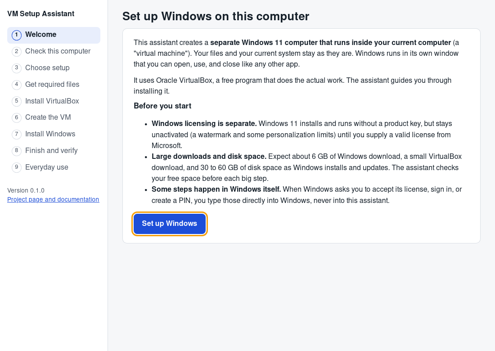
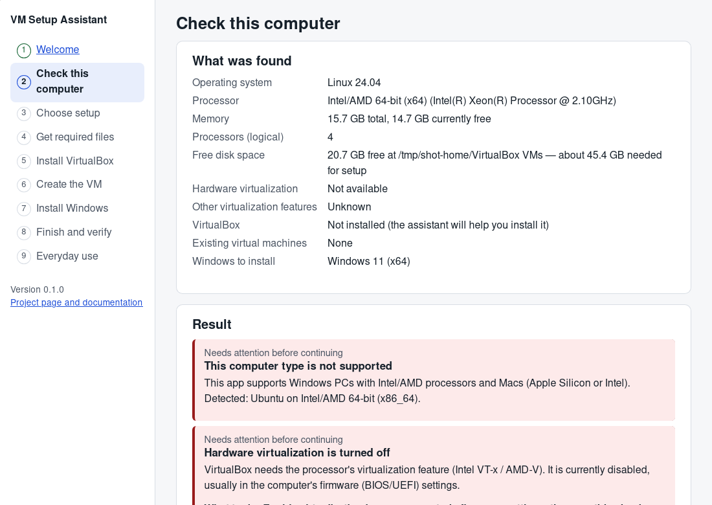

# VM Setup Assistant

**A friendly desktop app that sets up a Windows 11 virtual machine on your computer, step by step, using Oracle VirtualBox.**

## Set it up with an AI assistant

Copy the prompt below into an AI assistant that can **run commands on your computer** (for example ChatGPT with a coding/agent tool that has terminal access, or a coding agent such as Claude Code or Cursor). It will install the prerequisites, build the app from this repository, and tell you where the finished app is. A plain chat window with no terminal access cannot install anything for you, but it will still turn the prompt into the exact commands to run yourself.

This builds and installs the **assistant app** (a preview, unsigned build). The assistant is what then downloads VirtualBox and Windows 11 and creates the VM when you run it. No AI can create the Windows VM for you inside a sandbox; you run the built app on your own machine for that.

````text
You are helping me build and install a desktop app called "VM Setup Assistant" from its
source code, on my computer, using your command-execution/terminal tool. Work step by step,
show me each command before you run it, and stop and ask me if any step fails or needs my
password or a large download.

1. Check my operating system first. This app supports ONLY Windows 10/11 on x64 (Intel/AMD)
   and macOS 13+ (Apple Silicon or Intel). If I am on Linux or Windows-on-ARM, tell me a real
   build is not supported and stop.

2. Install any missing prerequisites:
   - Git
   - Node.js 20 LTS or newer (includes npm)
   - Rust via rustup (stable toolchain, 1.85 or newer)
   - macOS only: Xcode Command Line Tools  ->  xcode-select --install
   - Windows only: Microsoft C++ Build Tools (the "Desktop development with C++" workload)
     and the WebView2 runtime (already present on Windows 11).

3. Get the source:
   git clone https://github.com/BrooksMack/The-Bypass-Of-The-Beasts.git
   cd The-Bypass-Of-The-Beasts
   (If someone gave me a specific branch, run: git checkout <that-branch>  before continuing.)

4. Install dependencies and verify the project is healthy before building:
   npm ci
   npm run typecheck && npm test && npm run build
   cargo test --workspace

5. Build the desktop app:
   npm run tauri -- build
   Then tell me the exact path of the installer/app it produced (a .dmg on macOS, an .exe /
   NSIS installer on Windows) and how to launch it. To just try it without packaging, you can
   run:  npm run tauri -- dev

6. Remind me that this only installs the assistant app. When I launch it, the app itself
   downloads VirtualBox and the Windows 11 ISO and creates the VM. You do not need to, and
   cannot, create the Windows VM yourself.
````

> **Status: preview.** The app builds and its logic is tested, but the full "install Windows" path has **not yet been verified end-to-end on real hardware by this project**. Installers are currently **unsigned preview builds**. Read [What works today](#6-what-works-today-and-what-is-still-experimental) before relying on it.

## 1. What does this app do?

It creates a separate Windows 11 computer that runs inside a window on your current computer (a "virtual machine"). Your own files and system are not touched. The assistant:

- checks that your computer can run it (processor, memory, free disk space, virtualization),
- downloads the official VirtualBox installer from Oracle and verifies it,
- sends you to Microsoft's official page to get the Windows 11 installation file, then checks the file you picked,
- creates a sensibly configured virtual machine,
- guides you through Windows Setup and the finishing steps (Guest Additions, network, updates),
- gives you simple Start / Shut down / Save buttons afterwards, plus troubleshooting and a redacted support report.

It **does not include Windows or VirtualBox**. Both come from their official sources during setup.

## 2. Which computers does it support?

| Your computer | Windows that gets installed | Status |
|---|---|---|
| Windows 10/11 PC, Intel or AMD processor (x64) | Windows 11 x64 | Builds; end-to-end install not yet verified |
| Mac with Apple Silicon (M1 to M4) | Windows 11 on ARM (ARM64) | Builds; end-to-end install not yet verified |
| Mac with an Intel processor | Windows 11 x64 | Builds; end-to-end install not yet verified |
| Windows on ARM PC (Snapdragon) | not supported | Oracle calls VirtualBox on Windows/Arm experimental; the app stops with an explanation |
| Linux | not supported in this release | |

Requirements: 8 GB of memory (16 GB recommended), 4 processor cores recommended, about 45 GB of free disk space for setup, hardware virtualization enabled, macOS 13 Ventura or newer. Details: [docs/COMPATIBILITY.md](docs/COMPATIBILITY.md).

## 3. Which file should I download?

Go to the **[Releases page](https://github.com/BrooksMack/The-Bypass-Of-The-Beasts/releases)** and download the file for your computer:

| Your computer | Download (version 0.1.0, unsigned preview) |
|---|---|
| Windows PC (Intel/AMD) | [VM-Setup-Assistant-0.1.0-windows-x64-setup.exe](https://github.com/BrooksMack/The-Bypass-Of-The-Beasts/releases/download/v0.1.0/VM-Setup-Assistant-0.1.0-windows-x64-setup.exe) |
| Mac with Apple Silicon | [VM-Setup-Assistant-0.1.0-macos-apple-silicon.dmg](https://github.com/BrooksMack/The-Bypass-Of-The-Beasts/releases/download/v0.1.0/VM-Setup-Assistant-0.1.0-macos-apple-silicon.dmg) |
| Mac with Intel | [VM-Setup-Assistant-0.1.0-macos-intel.dmg](https://github.com/BrooksMack/The-Bypass-Of-The-Beasts/releases/download/v0.1.0/VM-Setup-Assistant-0.1.0-macos-intel.dmg) |
| Checksums | [VM-Setup-Assistant-0.1.0-SHA256SUMS.txt](https://github.com/BrooksMack/The-Bypass-Of-The-Beasts/releases/download/v0.1.0/VM-Setup-Assistant-0.1.0-SHA256SUMS.txt) |

Not sure which Mac you have? Apple menu › About This Mac: "Chip: Apple M…" means Apple Silicon; "Processor: Intel…" means Intel.

Because the preview builds are not code-signed yet:

- **Windows** shows "Windows protected your PC" (SmartScreen). Click **More info**, then **Run anyway**.
- **macOS** may say the app "cannot be opened because Apple cannot check it". Right-click (Control-click) the app in Applications and choose **Open**, then **Open** again. You only have to do this once.

Each release lists SHA-256 checksums so you can verify what you downloaded.

## 4. What will happen during setup?

1. **Check this computer**: shows what was found and separates real blockers from recommendations.
2. **Choose setup**: a name for the Windows computer and, in Advanced, memory/processors/disk size/storage folder. Sensible values are pre-filled.
3. **Get required files**: VirtualBox downloads automatically (about 150 to 400 MB, verified with SHA-256). For Windows 11 (about 6 GB) the app opens Microsoft's official page; you download the ISO there and select it in the app. The app checks that the ISO is Windows and the right kind (x64 or ARM64).
4. **Install VirtualBox**: the official Oracle installer opens. Your operating system asks for permission (Windows UAC, or your Mac password). If Windows wants a restart, restart and reopen the assistant; it continues where it was.
5. **Create the VM**: after a summary, the app creates the virtual machine through VirtualBox's supported command-line tool (`VBoxManage`) with UEFI, Secure Boot, TPM (on x64), 8 GB memory and 4 processors when your computer allows it, and a 100 GB disk that only grows as it is used.
6. **Install Windows**: Windows Setup runs in the VirtualBox window while a "What to do next" panel in the assistant tells you what to click. Licence acceptance, Microsoft account sign-in, verification codes and PIN are typed **into Windows**, never into the assistant.
7. **Finish and verify**: Guest Additions, network check, Windows Update and activation, each shown as verified, not yet, or pending. An IP address alone is never counted as "internet works"; you confirm that a web page loaded.
8. **Everyday use**: Start / Resume, Open the window, Shut down normally, Save state, Open the VM folder, Troubleshooting, Support report.

Closing the assistant **never** stops Windows: Windows keeps running in its own VirtualBox window.

## 5. Do I need a Windows license?

Windows 11 can be installed and used without a product key, but it stays **unactivated** (a watermark and some personalization limits) until you supply a valid license from Microsoft. The app does not include or generate keys, and activation is done inside Windows (Settings › System › Activation). VirtualBox itself is free (GPL). The optional VirtualBox Extension Pack has a separate Oracle license and is not needed for this setup.

## 6. What works today, and what is still experimental?

Verified by automated tests (no VirtualBox needed):

- Host detection including the real processor type even when the app runs translated (Rosetta 2 / Windows emulation)
- Conservative memory/processor sizing and blockers vs. recommendations
- ISO inspection from the disc's own metadata (volume label, EFI boot loader, Windows install image)
- Exact `VBoxManage` command construction for x64 and ARM64 profiles (names with spaces and Unicode are passed verbatim; nothing is interpolated into a shell)
- Download resume and SHA-256 verification; VirtualBox release selection from Oracle's SHA256SUMS
- Setup state persistence, corrupt-state recovery, "never create a second VM" resume logic
- Network diagnosis decisions including the "UsbNcm Code 10 after Windows Update" scenario on ARM
- Support-report redaction

Not yet verified on real hardware by this project (help wanted, see [docs/MANUAL-TEST-CHECKLIST.md](docs/MANUAL-TEST-CHECKLIST.md)):

- The complete flow on a real Windows x64 PC, Apple Silicon Mac and Intel Mac
- VirtualBox installer handoff and reboot resume
- Windows Setup boot, Guest Additions, display behaviour after resume

Known limitations:

- Unsigned preview installers (see [docs/RELEASING.md](docs/RELEASING.md) for what is needed to sign them)
- No unattended Windows installation: Windows Setup is guided, not automated
- USB webcam and Wi-Fi passthrough are not part of this release

## Screenshots

Taken from the real application (development build on Linux, 2026-09-28). Linux is not a supported host,
which is why the second screenshot shows the app stopping with a plain-language blocker instead of continuing.

| Welcome | Check this computer |
|---|---|
|  |  |

## Optional: VM identity for compatibility testing

An **off-by-default** feature lets you change the guest-visible hardware identifiers (firmware/SMBIOS,
system, disk and network adapter) for testing software that behaves differently inside a VM. It uses
only Oracle's documented `VBoxManage` settings, validates input, is fully reversible, and always shows
what it **cannot** hide. It does not make a VM undetectable. See
[docs/VM-IDENTITY.md](docs/VM-IDENTITY.md) and the
[identity checklist](docs/IDENTITY-CHECKLIST.md). Defaults are unchanged unless you enable it.

## Documentation

- [Troubleshooting](docs/TROUBLESHOOTING.md)
- [Compatibility and testing matrix](docs/COMPATIBILITY.md)
- [Manual test checklist](docs/MANUAL-TEST-CHECKLIST.md)
- [Architecture](docs/ARCHITECTURE.md)
- [VM identity configuration (compatibility testing)](docs/VM-IDENTITY.md)
- [Identity checklist: what Windows sees](docs/IDENTITY-CHECKLIST.md)
- [Development setup](CONTRIBUTING.md)
- [Releasing and signing](docs/RELEASING.md)
- [Security policy](SECURITY.md)
- [Third-party notices](THIRD-PARTY-NOTICES.md)
- [Changelog](CHANGELOG.md)
- [Handoff / progress log](docs/HANDOFF.md)

## Privacy

The app works entirely on your computer: no account, no backend, no analytics, no telemetry. Downloads go directly to Oracle and Microsoft. Support reports are created only when you ask, are redacted, are shown to you first, and are never uploaded.

## License

MIT for this project's code. Windows and VirtualBox remain under their own licenses; this project does not redistribute either.
